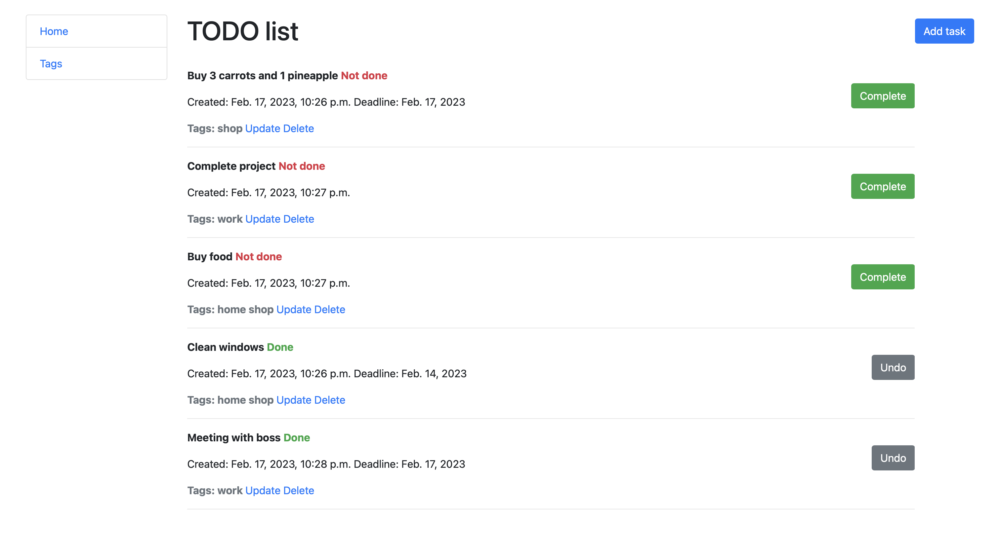

# TODO list

Django project where you can manage your tasks


## Installation

Python3 must be already installed

Сreate .env file as .env.sample

```shell
git clone https://github.com/yanpurdenko/py-todo-list.git
cd py-todo-list
python3 -m venv venv
sourse venv/bin/activate
pip install -r requirements.txt
python manage.py migrate
python manage.py runserver
```


## Features

- When you create task you can add tags
- Also create, update, delete tags
- CRUD functionality for tasks


## Demo

